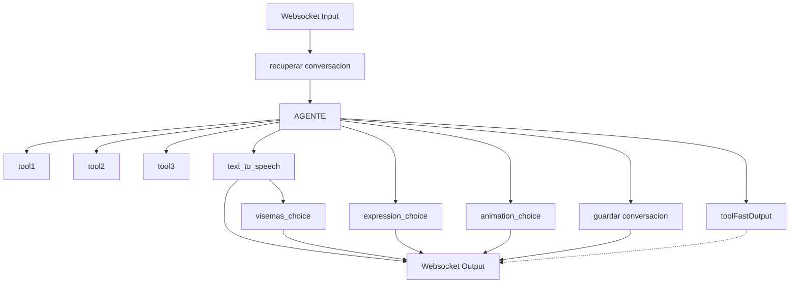

# Especificaciones Técnicas - Backend Avatar WebSocket

## Contexto General

Backend para responder por WebSocket un JSON en partes que son instrucciones para un avatar que interactúa con el usuario mediante voz.

## Stack del Backend

- **Python**
- **LangChain**
- **websockets** - Para comunicación WebSocket
- **APIs para generar voz** - Aún no decidida
- **Librosa** - Para generar visemas

## Modelos de IA

- **Modelo principal**: Claude Haiku
- **Capas adicionales**: `animation_choice` también requiere usar una IA como Haiku/OpenAI

## Características Importantes

### Arquitectura de Usuario
- No se necesita atender múltiples usuarios - es un backend para un solo frontend
- No se descarta la posibilidad de atender múltiples en el futuro, pero esta no es una decisión de peso para elegir la librería
- **Criterio de selección**: La elección debe ser la facilidad de codificar

### Agente
- El agente usa LangChain

### Tool FastOutput
- Existe para que el agente pueda enviar un primer mensaje del tipo "claro, déjame checar"
- Luego proceder a usar las demás herramientas
- Responder siguiendo el flujo normal

## Diagrama de Flujo



## Mapeo de Visemas

Los visemas requieren el siguiente mapeo de fonemas españoles a visemas VRoid:

```python
# Mapeo de fonemas españoles a visemas VRoid (0: neutral, 1: aa, 2: ih, 3: ou, 4: ee, 5: oh)
PHONEME_TO_VISEME = {
    # Vocales principales
    'a': 'aa',      # Boca abierta amplia
    'e': 'ee',      # Sonrisa, boca semi-abierta
    'i': 'ih',      # Sonrisa, boca cerrada
    'o': 'oh',      # Boca redonda
    'u': 'ou',      # Boca muy redonda, labios fruncidos

    # Consonantes -> mapear a la vocal más cercana o neutral
    'p': 'neutral', 'b': 'neutral', 'm': 'neutral',  # Labiales
    'f': 'ee', 'v': 'ee',                            # Fricativas -> sonrisa
    't': 'ih', 'd': 'ih', 'n': 'ih', 'l': 'ih',      # Alveolares -> ih
    's': 'ih', 'z': 'ih',                            # Fricativas -> ih
    'k': 'aa', 'g': 'aa',                            # Velares -> aa
    'r': 'aa',                                       # Vibrante -> aa
    'ch': 'ih', 'y': 'ih',                           # Palatales -> ih
    'h': 'aa',                                       # Aspirada -> aa
    'j': 'aa',                                       # J española -> aa
    'ñ': 'ih',                                       # Ñ -> ih

    # Silencio
    'sil': 'neutral'  # Posición neutral/descanso
}
```

## Formato de JSON de Salida

El sistema envía las instrucciones para el avatar mediante WebSocket en el siguiente formato JSON:

```json
{
  "audio_url": "/voice/output.wav",
  "visemas": [
    { "visema": "aa", "tiempo": 0.0 },
    { "visema": "oh", "tiempo": 0.08 },
    { "visema": "ih", "tiempo": 0.15 },
    { "visema": "neutral", "tiempo": 0.28 },
    { "visema": "oh", "tiempo": 0.86 },
    { "visema": "ih", "tiempo": 1.16 },
    { "visema": "aa", "tiempo": 1.46 },
    { "visema": "ih", "tiempo": 1.79 },
    { "visema": "aa", "tiempo": 1.92 },
    { "visema": "neutral", "tiempo": 2.05 }
  ],
  "expresiones": [
    { "expresion": "happy", "tiempo": 0.0, "intensidad": 1.0 },
    { "expresion": "blink", "tiempo": 1.0, "intensidad": 1.0 },
    { "expresion": "neutral", "tiempo": 3.5, "intensidad": 1.0 }
  ],
  "animaciones": [
    {"animation": "hello", "tiempo": 0.0},
    {"animation": "idle", "tiempo": 3.0}
  ]
}
```

## Formato de JSON de Salida

El sistema envía las instrucciones para el avatar mediante WebSocket en el siguiente formato JSON:

```json
{
  "audio_url": "/voice/output.wav",
  "visemas": [
    { "visema": "aa", "tiempo": 0.0 },
    { "visema": "oh", "tiempo": 0.08 },
    { "visema": "ih", "tiempo": 0.15 },
    { "visema": "neutral", "tiempo": 0.28 },
    { "visema": "oh", "tiempo": 0.86 },
    { "visema": "ih", "tiempo": 1.16 },
    { "visema": "aa", "tiempo": 1.46 },
    { "visema": "ih", "tiempo": 1.79 },
    { "visema": "aa", "tiempo": 1.92 },
    { "visema": "neutral", "tiempo": 2.05 }
  ],
  "expresiones": [
    { "expresion": "happy", "tiempo": 0.0, "intensidad": 1.0 },
    { "expresion": "blink", "tiempo": 1.0, "intensidad": 1.0 },
    { "expresion": "neutral", "tiempo": 3.5, "intensidad": 1.0 }
  ],
  "animaciones": [
    {"animation": "hello", "tiempo": 0.0},
    {"animation": "idle", "tiempo": 3.0}
  ]
}
```

## Estructura de Código Sugerida

```
/
├── main.py
├── settings.py
├── agents/
├── agents/tools/
├── ia_models/
└── utils/
```

### Notas sobre WebSocket
- Se usará la librería `websockets` de Python

### Notas sobre main.py
- En main tener un método al que el usuario pide y este responde
- Normalmente en el main se coloca un builder o cadena de responsabilidad para responder, pero como ahora es websockets y la respuesta es fragmentada, no se sabe cómo ordenar el código de este método
- Soy muy amante de poder leer el código y que este se entienda (no tanto en plan seguir todos los patrones de diseño, más en plan leer el main y que se entienda todo sin tener que ir a subdirectorios para leer más)

### Pseudocódigo Sugerido

```python
# main.py
import websockets
import asyncio

class ResponseSender:
    def __init__(self, websocket):
        self.websocket = websocket
    
    async def send(self, data):
        await self.websocket.send(data)

# Agente global (inicializado una vez)
AGENT = Agent(tools=[tool1, tool2, tool3, toolFastOutput])

async def main(message, sender: ResponseSender):
    conversation = await recuperar_conversacion(message)
    agent_response = await AGENT.foo(message, conversation)
    await asyncio.gather(
        _parallel1(agent_response, sender),
        _parallel2(agent_response, sender), 
        _parallel3(agent_response, sender)
    )

async def _parallel1(agent_response, sender):
    await guardar_conversacion(agent_response)
    speech = await text_to_speech(agent_response) 
    await sender.send(speech)
    visemas = await visemas_choice(agent_response, speech) 
    await sender.send(visemas)

async def _parallel2(agent_response, sender):
    expressions = await expression_choice(agent_response) 
    await sender.send(expressions)

async def _parallel3(agent_response, sender):
    animations = await animation_choice(agent_response)
    await sender.send(animations)

async def websocket_handler(websocket, path):
    # Aquí se inicializa el ResponseSender
    sender = ResponseSender(websocket)
    
    async for message in websocket:
        try:
            await main(message, sender)
        except Exception as e:
            await sender.send({"error": str(e)})

# Para inicializar el servidor websocket
async def start_server():
    server = await websockets.serve(websocket_handler, "localhost", 8765)
    await server.wait_closed()

if __name__ == "__main__":
    asyncio.run(start_server())
```

## Flujo de Procesamiento

1. **Input**: WebSocket recibe mensaje del usuario
2. **Agente**: Procesa con LangChain usando Claude Haiku
3. **Tools**: El agente puede llamar herramientas (tool1, tool2, tool3, toolFastOutput)
4. **Procesamiento paralelo**:
   - `text_to_speech` → genera audio
   - `expression_choice` → selecciona expresiones (usa IA)
   - `animation_choice` → selecciona animaciones (usa IA)
5. **Procesamiento secuencial**: `text_to_speech` → `visemas_choice` (usa Librosa)
6. **Output**: Todos los componentes envían sus resultados por WebSocket como JSON